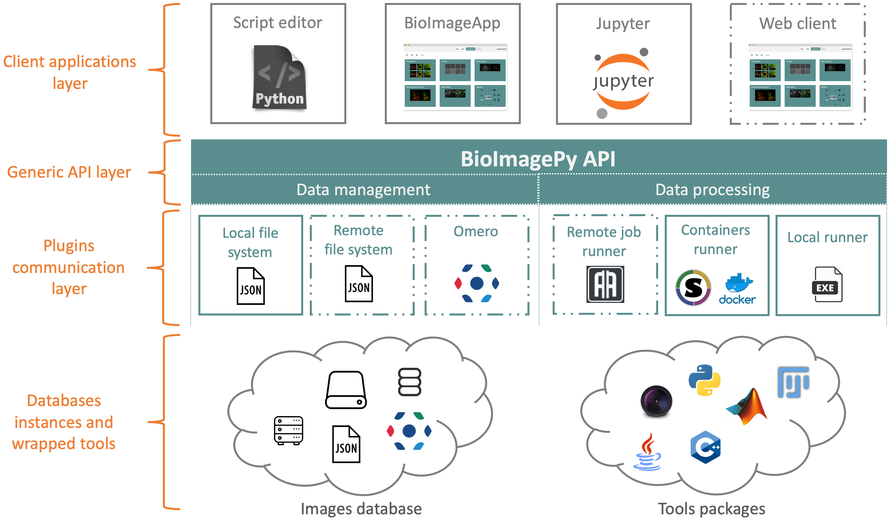

.. _guide:

Guide
=====

BioImageIT-core is a python3 library. It implements the main API for BioImageIT middleware. 
In the scheme below we can see the position of BioImageIT-core in the BioImageIT ecosystem. In fact, BioImageIT-core is the 
API that connects low level image processing and data management to high level end users applications.

For data management, BioImageIT-core implements a set of functions to manage and annotate data at the Experiment (ie project)
level. For image processing tools, BioImageIT-core implements a set of functions to query a tool database and 
to run tools on data.

For Data management and process management, BioImageIT-core defines an API that can be implemented with plugins. By 
default, data is managed in a JSON file system. If we want to use the BioImageIT-core API to manage data on 
a SQL database for example, we can implement a data management plugin that links the BioImageIT-core API with the SQL database. 
For process run, BioImageIT-core by defaut runs tools using Conda packages of Docker containers in the local machine. If we want to run a processing
tool with a job scheduler for example, we can write a process runner plugin that links the BioImageIT-core API to the job scheduler.

The advantage of this BioImageIT-core architecture is to enable writing high level python code to manage and annotate data and deploy it 
in different hardware or network architecture without the need to update the high level code. Only plugins have to be added.

Data Management
---------------

In the BioImageIT project, we propose to manage data using a 3 layers representation:

* **Experiment**: an experiment is a project that contains one dataset of raw data named "data" and a list of processed datasets. Each processed dataset contains the outputs of a processing tool.
* **DataSet**: a dataset contains a list of data that can be raw or processed
* **Data**: a data contains a single data and the associated metadata. For a ``RawData`` metadata are a set of *key:values* pairs information to identify data and a generic dictionnary for any specific metadata (like image resolution...). For ``ProcessedData``, metadata are a link to the origin data and the process run information. 

In this section we show the main functions implemented in the BioImageIT-core library to handle ``Data``, ``Dataset`` and ``Experiment``. Please
refer to the docstring documentation to get more advanced features.
To create an experiment, *BioImageIT-core* has a dedicated function with the following syntax:

.. code-block:: python3

    myexperiment = Experiment()
    myexperiment.create('myexperiment', 'Sylvain Prigent', './')

This creates an empty repository with the basic metadata of the experiment. Then we can import a single data:

.. code-block:: python3

    myexperiment.import_data(data_path='data_uri', name='mydata', author='Sylvain Prigent', format_='tif', date='now', tags={"key": value})

or a multiple data from a directory:

.. code-block:: python3

    myexperiment.import_dir(dir_uri='./my/local/dir/', filter_='\.tif$', author='Sylvain Prigent', format_='tif', date='now', directory_tag_key="session")

Then the next step is to tag the data. It can be done in batch with functions like:

.. code-block:: python3

    myexperiment.tag_from_name(tag='population', values=['population1', 'population2'])

or:

.. code-block:: python3

    myexperiment.tag_using_seperator(tag='ID', separator='_', value_position=1)

that will create key-value pairs for each data by extracting information from the data file names. 
The first case will search the words *population1* and *population2* in the data file name and 
associate it to the key *population* if one of the the words *population1* or *population2* is found. 
The second case shows how to extract information from the data file name using separators. Here we 
extract the sub-string in the file name that is located between two *_* and after the first *_*, 
and associate the extracted value to the key *ID*.
We can also manually annotate one data by extracting it and manually adding a key-value pair:

.. code-block:: python3

    data = myexperiment.get_data(dataset_name: 'data', query: 'name=population1_001.tif')
    data.set_tag("population", "Population1")
    data.set_tag("ID", "001")

The *BioImageIT-core* library also allows to access directly a ``DataSet``:

.. code-block:: python3

    raw_dataset = myexperiment.get_dataset(name: 'data')

and interact with the data in the ``DataSet``:

.. code-block:: python3

    data = raw_dataset.get_data(...)
    raw_dataset.add_data(...)

Process Running
---------------

In the BioImageIT project manage processing tools as external packages (like Conda packages or Docker containers) and uses XML wrappers similarly to the Galaxy Project in order to wrap tools to the BioImageIT Runner.
The *BioImageIT-core* library, implements functionalities to manipulate and run packaged tools using three level: Process, Runner and Pipeline.

A ``Process`` is a python class in *BioImageIT-core* that allows to identify a processing tool. It load the tool XML file and allows to print and access the process information. 

.. code-block:: python3

    myprocess = Process(url/of/the/process/wrapper.xml)
    myprocess.man()

In practice, we do not need to instantiate directly a ``Process`` since *BioImageIT-core* provides a ``ProcessAccess`` 
class that manage a process database. We can then access a ``Process`` simply using the tool name and version:

.. code-block:: python3 

    myprocess = ProcessAccess().get('sampletool_v0.0.1')
    myprocess.man()

The ``Runner`` class allows to run a process on data. This is the core class of the processing 
functionality of *BioImageIT-core*. Running a process can be done as follows:

.. code-block:: python3 

    myrunner = Runner(ProcessAccess().get('ndsafir_v1.0.0') 
    myrunner.exec('i', 'myimage.tif',
                  'patch', patch,               
                  'iter', iteration,
                  'o', 'denoised.tif') 

Finally the ``Pipeline`` class is a convenient class that allows to run a sequence of processes for data stored in an ``Experiment``:

.. code-block:: python3 

    mypipeline = Pipeline(Experiment('my/experiment/uri'))

    p1 = mypipeline.add_process('spartion2d_v1.0.0')
    p1.set_parameters('sigma', '3', 
                      'weighting', '0.1', 
                      'regularization', '2')
    p1.add_input('i', 'data', '')
    p1.set_dataset_name('deconv2d')

    p2 = mypipeline.add_process('particleanalyzer_v1.0.0')
    p2.set_parameters('threshold', 'Default dark')
    p2.add_input('i', 'deconv', '')
    p2.set_dataset_name('particles')

    mypipeline.run()

Further reading
---------------

In this short introduction guide we show the basic informations we need to use *BioImageIT-core*. For a more advanced use, we recommend
reading the following tutorials.
