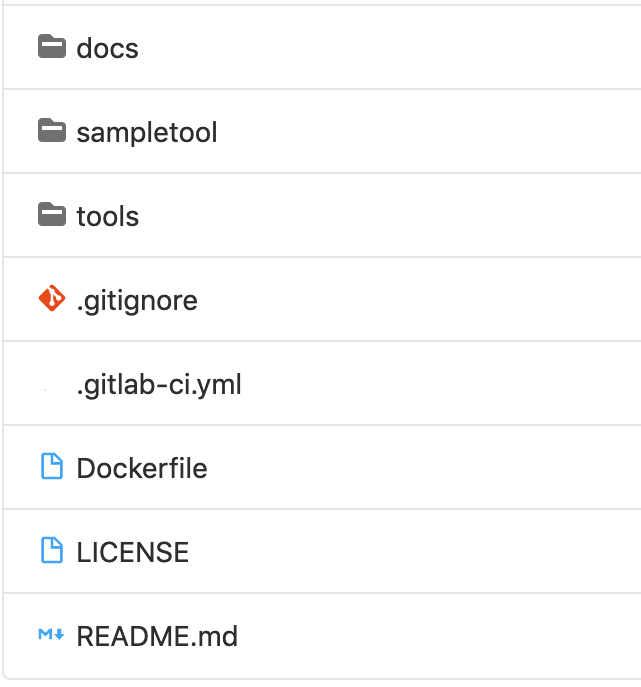

Tutorial: wrap a tool
=====================

In this tutorial, we details the recommend standardized architecture for a tool package. This architecture facilitate 
tools access and sharing. 

   Figure 1: Recommended content for a tool package.

The package architecture is shown in Figure 1. It is organized as follows:

* The main directory is called with the same name as the package (``sampletool`` in the example) and contains the source code of the tool. The developer of the tool can use any organization of the code inside this directory. 
* The directory ``docs`` contains the user documentation of the tool. We recommend to add here the source code of the documentation that can be build with the continuous integration, and to use a web format like *Jekyll*. Nevertheless, one can use any other web format or build a PDF file. 
* The directory ``tools`` contains the wrappers (XML description files) of each tool that is contained in the source code.
* ``LICENSE`` is the file containing the license. It is very important to have a license file before sharing a tool. 
* ``README.md`` file is the classical entry point of the repository where to write minimal description of the repository.
* The ``.gitlab-ci.yml`` file is the recipe file that *GitLab* uses to automatically build the code, the container and the documentation each time the repository is updated. The GitHub equivalent is the GitHub workflows.

In the following, we present in more details the tool wrapping, packaging, and the automatic building with *gitlab-ci*.

Wrapper
-------

The ``tools`` directory is the same as the one used in the Galaxy Project toolshed repositories. It contains one XML file per 
tool and one file called ``.shed.yml`` that associate the tools to toolboxes. The content of the ``.shed.yml`` for the 
*sampletool* is shown below. As we can see it contains the list of toolbox names, and short description of the tool and 
it origin.

.. code-block:: yaml

  categories: 
    - Denoising
    - Filtering
  description: 2D image smooth with mean filtering  
  homepage_url: https://gitlab.inria.fr/bioimage-it/sampletool/
  long_description: 2D image smooth with mean filtering 
  name: SampleTool
  owner: sprigent

The tool wrapper is in the file called ``sampletool.xml``. Its content is shown bellow. It is a classical Galaxy Project wrapper. 
The command is ``meanfilter`` and take three arguments, the input image ``-i``, the output image ``-o`` and one parameter ``-r`` 
the radius of the filter. The two important information in this wrapper are the ``<requirements>`` section that contains the 
address of the *Docker* image container that we will be generated with the *gitlab-ci*, and the address of the documentation 
in ``<help>`` that will be generated by the *gitlab-ci* pages.  

.. code-block:: xml

    <tool id="sampletool" name="SampleTool" version="0.1.0" python_template_version="3.5">
        <requirements>
            <container type="docker">registry.gitlab.inria.fr/
            bioimage-it/sampletool:766efe8b8397fef0115e20f...
            </container>
        </requirements>
        <command detect_errors="exit_code"><![CDATA[
            meanfilter -i ${i} -o ${o} -r ${r}
        ]]></command>
        <inputs>
            <param type="data" name="i" format="tiff" label="Input Image" help="2D image" />
            <param argument="-r" type="integer" value="3" label="Radius" help="Filter radius (in pixels)" />
        </inputs>
        <outputs>
            <data name="o" format="tiff" label="Output image" />
        </outputs>
        <tests>
            <test>
                <param name="i" value="celegans.tif" />
                <param name="r" value="3" />
                <output name="o" file="celegans_result.tif" 
                compare="sim_size" />
            </test>
        </tests>
        <help><![CDATA[
            https://bioimage-it.gitlabpages.inria.fr/sampletool/
        ]]></help>
        <citations>
        </citations>
    </tool>

In this example, we have only one *XML* wrapper and one *.shed.yml* file. In the case we wrap a library with many tools 
that does not belong to the same toolbox, we can then create one sub-folder per toolbox in the ``tools`` directory where 
each sub-folder contains one *.shed.yml* and one or many *XML* wrappers.   

Container
---------

The goal of this section is not to write a tutorial about *Docker* but to explain how we use *Docker* for packaging and 
deploying image processing tools. A full tutorial of Docker can be found at `<https://docs.docker.com/get-started/>`_.

For image processing packaging, the idea is to install the tool in a *Docker* container using the *unix* install standard and 
then make this container available using a public registry.

To create a Docker container, we need to write a **Dockerfile**, that will allows the Docker image creation. Then the docker 
image can be built using the command ``docker build``. In our case we will run the build command within the continuous 
integration tools of *GitLab*. In this section we will only create the *Dockerfile*, and we show in the next section how to 
build it with continuous integration.

Let's take the example of the ``sampletool`` program. It is a c++ program depending on linux libraries: libpng, libtiff. The 
goal of the *Docker* container is to install these libraries and the program itself completely isolated from the host system. 
The *Dockerfile* of the ``sampletool`` is shown bellow. 

.. code-block:: docker

    FROM ubuntu:20.04
    WORKDIR /app
    COPY . /app
    RUN apt-get update  && \
        apt-get -y upgrade  && \
        apt-get -y install cmake  && \
        apt-get -y install g++  && \
        apt-get -y install libpng-dev  && \
        apt-get -y install libtiff-dev  && \
        cd sampletool  && \
        mkdir build  && \
        cd build  && \
        cmake ..  && \
        make  && \
        cd ..
    
    ENV PATH="/app/sampletool/sampletool/build/bin:$PATH"    

    CMD ["bash"]

This *Dockerfile* contains 6 instructions. The ``FROM`` instruction specify the parent *Docker* image. We choose here an Ubuntu 
image since it is the operating system where the c++ code have been tested. Of course one can choose any parent image that fit 
the best the program needs. The ``WORKDIR`` specify the directory where the program will be installed on the Docker container. 
The ``COPY`` instruction is used to copy the sources of *sampletool* to the *Docker* image during the image build. ``RUN`` 
instruction is executed during the container build. Here we added all the Ubuntu commands we need to install the c++ code 
dependence and build the code. In this example the ``ENV`` command allow us to update the PATH variable to declare our 
code in the linux *PATH* so that the command line tool *meanfilter* is accessible. Finally ``CMD`` is the command executed 
when the container starts.

Documentation
-------------

The ``docs`` folder of the repository contains the user documentation. This documentation should be a tutorial or a step by step 
explanation of how to use the tool on real data. For the documentation we recommend two things: using a web format and write 
it base one use cases.

The web format is very important to ease the tool access. With a web format, the documentation can be read as stand alone in a 
web browser, integrated in data processing application and easy linked. In this example we use the **Jekyll** page generator 
since it is a convenient tool supported by *GitLab* to write and generate static web pages. Pages can be very simple or more 
sophisticated depending on the need. 

A documentation based on application use cases is very important to transfer image processing tools from the applied 
mathematics community to the Bio-imaging community. In this *sampletool* we recommend organizing the document in 4 sections:

* **Examples**: this section should contain a gallery of images showing the type of data that the tool has been created for, and show examples of obtained results. This allows a visual way to quickly see if a tool can be adapted or not for an application.  
* **Method**: this section should explain with easy words the underlying mathematical model and explain why it is adapted for some type of data and not adapted for other type of data. For example a denoising method with a Gaussian model will be adapted for Gaussian noise but not for Poisson noise. 
* **Parameters**: this section should explain the role of each parameter and how to tune them depending on the data. Again, using real data examples are the best way to show the influence of each parameter.
* **References**: this section should list the bibliography references where the original tool have been published and the references to cite when we publish results using the tool.

Gitlab-ci
---------

The *GitLab* continuous integration tools allows to test the code, build the docker container image and the documentation. The 
container is then accessible through a *Docker* registry and the documentation through a web page. Of course the continuous 
integration contains many other features but in the context of *BioImageIT* we focus on the code testing, docker container and 
documentation.

A tutorial on how to use continuous integration with *GitLab* is available 
`here <https://gitlab.inria.fr/sed-rennes/formations/formation-gitlab-ci-slides/-/blob/master/tutorial.pdf>`_.

The continuous integration instruction for each project have to be written in a file called ``.gitlab-ci.yml``. Then, each time 
the code is updated (with ``git push``), the commands in the ``.gitlab-ci.yml`` file are executed in a runner. 
The Figure bellow shows the ``.gitlab-ci.yml`` file for the sample project. As we can see it has 7 sections. First 
**image** specify the base docker image where the continuous integration will be ran. In our case since the c++ code runs on 
Ubuntu we choose an Ubuntu image. Then **variables** allows to declare environment variables, and **before_script** contains 
the commands to initialize the build environment. We added here the commands to install the c++ code dependencies and the *jekyll* 
framework to build the documentation. Finally the four last sections are the code testing and the Docker container image 
and documentation generation:

* **job_compilation**: This is a build stage, where we build the c++ code. If the job succeed it means that the compilation went correctly.
* **job_unit_tests**: This is a test stage to run unit tests for the c++ program. If this test pass, it means that the c++ code runs correctly.
* **pages**: This stage build the documentation from the sources documentation of the ``docs/`` folder. The documentation is built in the ``public/`` folder of the *GitLab* repository accessible at the URL *https://bioimage-it.gitlabpages.inria.fr/sampletool/*.
* **build_docker**: This is a build step that build the Docker container image from the \textit{Dockerfile} in the repository. The Docker \textit{push} command add the image to the GitLab Docker registry available at *https://gitlab.inria.fr/bioimage-it/sampletool/container_registry*.

.. code-block:: yaml

    image: ubuntu:20.04

    variables:
    JEKYLL_ENV: production
    DEBIAN_FRONTEND: noninteractive
    
    before_script:
    - apt-get update
    - apt-get -y install cmake
    - ...
    - gem install jekyll bundler
    
    job_compilation:
    stage: build
    script:
        - cd sampletool
        - mkdir build
        - cd build
        - cmake ..
        - make
        - cd ..
    job_unit_tests:
    stage: test
    script:
        - ...
        - cd tests
        - ctest
        
    pages:
    script:
        - cd docs
        - bundle install
        - bundle exec jekyll build -d ../public/
    artifacts:
        paths:
        - public/
    only:
        - master
        
    build_docker:
    stage: build
    image: docker:latest
    before_script:
        - env
        - docker --version
        - docker login -u gitlab-ci-token -p $CI_JOB_TOKEN $CI_REGISTRY 
    script:
        - docker build -t $CI_REGISTRY_IMAGE:$CI_COMMIT_SHA .
        - docker push $CI_REGISTRY_IMAGE:$CI_COMMIT_SHA

Summary
-------

In this tutorial, we show with an example how to create a tool package compatible with *BioImageIT* recommendations. This has 
the advantages of not changing anything in the original source code, but just adding *wrapper* and *Docker* recipe. Using 
*GitLab* allows an easy and powerful way to automate the build steps and public sharing.
In the example we use, everything is in a single git repository since the source code is open and can be publicly available. 
In the case where the source code is not open but we want to make the tool available through a *Docker* image, we can create 
two repositories. One private repository with the source code that generate a public *Docker* container image, and a public 
repository with the *wrappers* and the *documentation*.  
